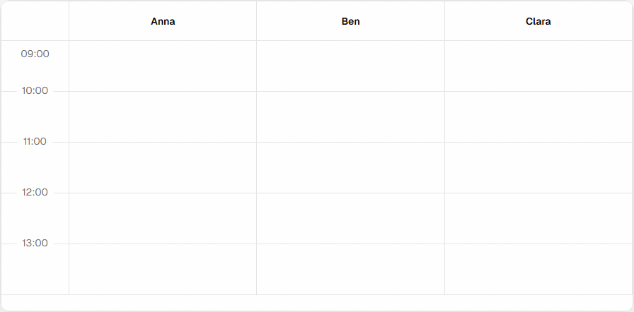

# shaduler

A composable scheduler grid for shadcn/ui — primitives plus opt-in headless hooks.

<picture>
  <source media="(prefers-color-scheme: dark)" srcset="hero-dark.gif">
  
</picture>

## Install

Inside any shadcn/ui project:

```bash
pnpm dlx shadcn@latest add https://shaduler.vercel.app/r/shaduler.json
```

One file lands at `components/ui/shaduler.tsx`. No NPM package, no extra
build step, and the component inherits your shadcn theme automatically.

## What you get

- **15 primitives** that compose into the layout you want (`Shaduler`, `ShadulerGrid`, `ShadulerTask`, …). No black-box monolith.
- **3 opt-in hooks** for drag, resize, and range-select. Display-only mode is one render away.
- **shadcn-native theming.** Every colour is a CSS variable; tasks render as `default` / `secondary` / `outline` / `destructive` variants.
- **Time-of-day grid.** Y axis is always time. Multi-day events go in the separate `ShadulerAllDayStrip`; cross-midnight splits at the data layer.

Built for React 19 + Tailwind v4. Works on touch.

---

**[Full docs →](https://shaduler.vercel.app/)** for setup walkthrough, primitive reference, hooks, recipes, and a live theme picker.
